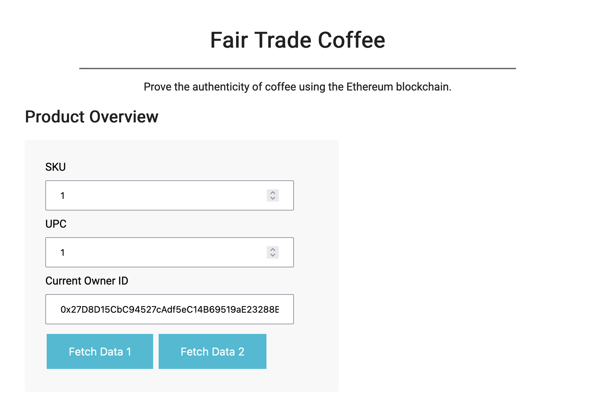
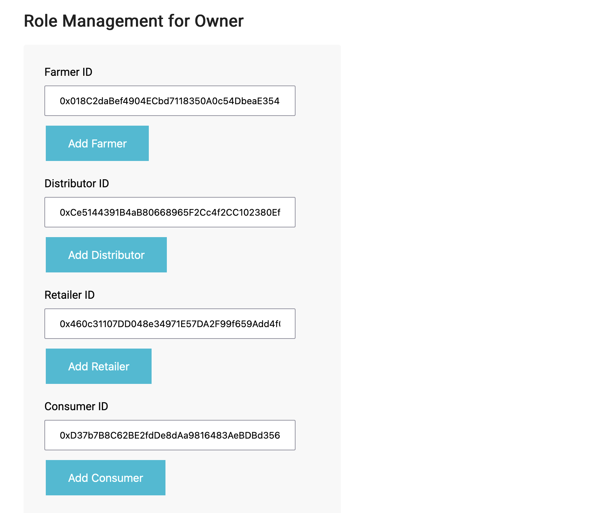
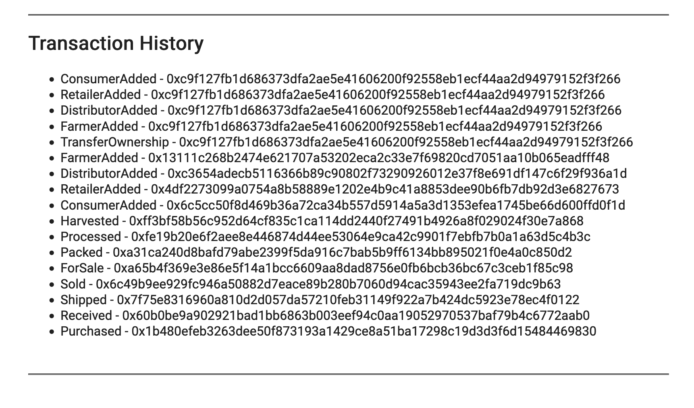
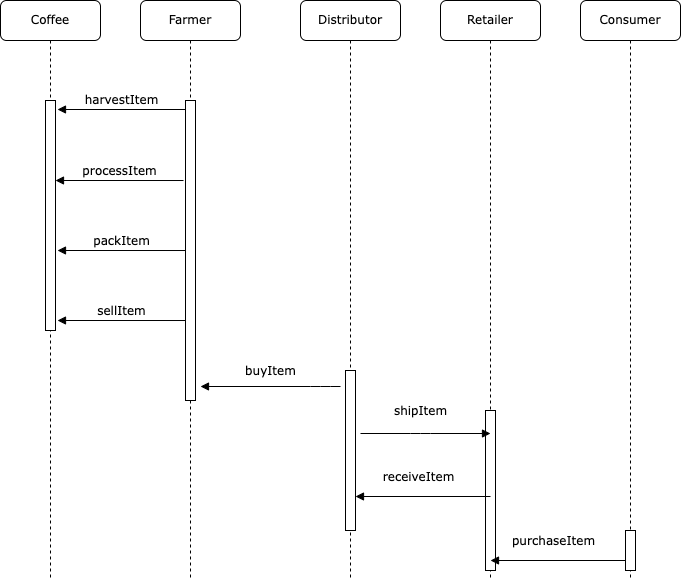

[To the Website](https://supply-blockchain.surge.sh/)

[Code on Github](https://github.com/Caruso33/blockchain_dapps/tree/master/udacity_blockchain_development/3_ethereum_dapp)

# Supply chain & data auditing

This repository contains an Ethereum DApp that demonstrates a Supply Chain flow between a Seller and Buyer. The user story is similar to any commonly used supply chain process. A Seller can add items to the inventory system stored in the blockchain. A Buyer can purchase such items from the inventory system. Additionally a Seller can mark an item as Shipped, and similarly a Buyer can mark an item as Received.

## Deployment

The contracts were deployed to rinkeby, see the logging at the bottom.
The SupplyChain contract can be found on [rinkeby.etherscan](https://rinkeby.etherscan.io/address/0x86406bd74f67fb3245e380294d59a5d2350ce20e)

## Accounts

There are different accounts involved. Through the public mnemonic, the accounts can be accessed. The private keys are as follows:

Owner: 9137dc4de37d28802ff9e5ee3fe982f1ca2e5faa52f54a00a6023f546b23e779  
Farmer: 18911376efeff48444d1323178bc9f5319686b754845e53eb1b777e08949ee9b  
Distributor: f948c5bb8b54d25b2060b5b19967f50f07dc388d6a5dada56e5904561e19f08b  
Retailer: fad19151620a352ab90e5f9c9f4282e89e1fe32e070f2c618e7bc9f6d0d236fb  
Consumer: 19d1242b0a3f09e1787d7868a4ec7613ac4e85746e95e447797ce36962c7f68b

## Interface

The DApp User Interface looks like this:












## Built With

- [Ethereum](https://www.ethereum.org/) - Ethereum is a decentralized platform that runs smart contracts
- [IPFS](https://ipfs.io/) - IPFS is the Distributed Web | A peer-to-peer hypermedia protocol
  to make the web faster, safer, and more open.
- [Truffle Framework](http://truffleframework.com/) - Truffle is the most popular development framework for Ethereum with a mission to make your life a whole lot easier.

## Acknowledgments

- Solidity
- Ganache-cli
- Truffle
- IPFS

## Deployed rinkeby addresses

```shell
Using network 'rinkeby'.

Running migration: 1_initial_migration.js
  Deploying Migrations...
  ... 0xd371dd184a815c5e30b3f1021d620805ebc8061caf0c3b04b167bfba58cf7777
  Migrations: 0xd4cf81f0d9c091fae545e9f27e67f230b6dc01c7
Saving successful migration to network...
  ... 0x2a4b80266df29e2423af25c4f0c6c9c69b4db7bd5e8bc0fdc8161e44676b4cb5
Saving artifacts...
Running migration: 2_deploy_contracts.js
  Deploying FarmerRole...
  ... 0xae4a1207ef8ab80210ca9bcbea5b8e9dc25cd126bb7022eac512629fee93ab8f
  FarmerRole: 0x22d49e41ac0339f15de78de427d2e376742d9ef3
  Deploying DistributorRole...
  ... 0x1239df0ec48fa845a353624d30bb16eee3cfd512361310f08d75d84ca2d30afc
  DistributorRole: 0x2fc69c95c0fa461fcf3174ea1329cd2963588494
  Deploying RetailerRole...
  ... 0xf40eaf45c72910077f4cd31d99564d3632d03d41d661d417c7b7347e3c6d5cd4
  RetailerRole: 0x74ba1698d88f0b0c99c81e995b024399d10b7c2a
  Deploying ConsumerRole...
  ... 0x11fe5ba886dac3a01cd1effcfa72345ae890be904d509602fbc6541cb2f192c4
  ConsumerRole: 0x7b9e86fd39e89a4e6834f9d5077524ba09195081
  Deploying SupplyChain...
  ... 0x46fd86c88a74b4238aa43ad1692d9aa7ce5acf60c89cf68d9a08cddb1b93813e
  SupplyChain: 0x86406bd74f67fb3245e380294d59a5d2350ce20e
Saving successful migration to network...
  ... 0xb11444ee013f9ff0e8cb4555e3ce48dc649e95432dcbd708941cb4338e268c8a
Saving artifacts...
```

## Running the code locally

These instructions will get you a copy of the project up and running on your local machine for development and testing purposes. See deployment for notes on how to deploy the project on a live system.

### Prerequisites

Please make sure you've already installed ganache-cli/-gui, Truffle and enabled MetaMask extension in your browser.

### Installing

> The starter code is written for **Solidity v0.4.24**. At the time of writing, the current Truffle v5 comes with Solidity v0.5 that requires function _mutability_ and _visibility_ to be specified (please refer to Solidity [documentation](https://docs.soliditylang.org/en/v0.5.0/050-breaking-changes.html) for more details). To use this starter code, please run `npm i -g truffle@4.1.14` to install Truffle v4 with Solidity v0.4.24.

A step by step series of examples that tell you have to get a development env running

Clone this repository:

```
git clone https://github.com/Caruso33/blockchain_dapps/
```

The source code can be [found here](https://github.com/Caruso33/blockchain_dapps/tree/master/udacity_blockchain_development/3_ethereum_dapp)

Change directory to `dapp` folder and install all requisite npm packages (as listed in `package.json`):

```
cd dapp
npm install
```

Launch Ganache:

```
ganache-cli -m "spirit supply whale amount human item harsh scare congress discover talent hamster"
```

Your terminal should look something like this:


In a separate terminal window, Compile smart contracts:

```
truffle compile
```

Your terminal should look something like this:


This will create the smart contract artifacts in folder `build\contracts`.

Migrate smart contracts to the locally running blockchain, ganache-cli:

```
truffle migrate
```

Your terminal should look something like this:


Test smart contracts:

```
truffle test
```

All 10 tests should pass.


In a separate terminal window, launch the DApp:

```
npm run dev
```
