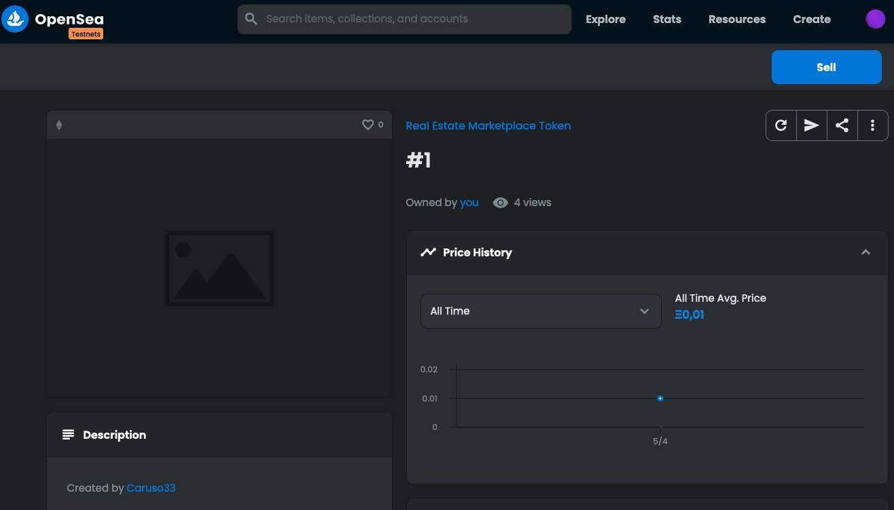

# Udacity Blockchain Capstone

The capstone will build upon the knowledge you have gained in the course in order to build a decentralized housing product.

# Project Resources

- [Remix - Solidity IDE](https://remix.ethereum.org/)
- [Visual Studio Code](https://code.visualstudio.com/)
- [Truffle Framework](https://truffleframework.com/)
- [Ganache - One Click Blockchain](https://truffleframework.com/ganache)
- [Open Zeppelin ](https://openzeppelin.org/)
- [Interactive zero knowledge 3-colorability demonstration](http://web.mit.edu/~ezyang/Public/graph/svg.html)
- [Docker](https://docs.docker.com/install/)
- [ZoKrates](https://github.com/Zokrates/ZoKrates)

## Dependencies

`yarn` - install deps

## Test

Run ganache and `yarn test`

## Contract Address

```bash
Zokrates address: 0xaD975B3FF1D1FB6A216430a05bF7de317eB9Cb1E
SolnSquare address: 0x0B19963b4B03c03aa46Cadf0f32fa016b41DaB6A

# Zokrates address: 0x8fEA56607bDBA9B3490b18bDf52D3783B126DfF5
# SolnSquare address: 0x0441335a457883EC1Bbe22eBdCbC10769088943a

# Zokrates address: 0x17485cCc43eC081FB6F309c62ADf1fEb50f50598
# SolnSquare address: 0xd869A46B12a688764986CD1015aCAf649dF30c50

# Zokrates address: 0xB5BFCa5B8938834B2B5E475CBDC9E31E4554fE64
# SolnSquare address: 0x7Dde7f48c32eE30AfB712A7405d90807Ce2A046A
```

## ABIs

[ERC721Token.json](./doc/ERC721Token.json)
[ZokratesVerifier.json](./doc/ZokratesVerifier.json)
[SolnSquareVerifier.json](./doc/SolnSquareVerifier.json)

## Links

[Etherscan contract address](https://rinkeby.etherscan.io/address/0x7dde7f48c32ee30afb712a7405d90807ce2a046a)

[Opensea storefront](https://testnets.opensea.io/collection/real-estate-marketplace-token)

## Images




